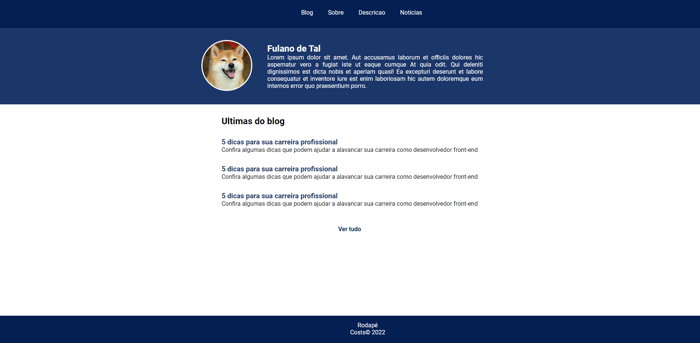

<h1 align="center">Blog pessoal - react</h1>
<p align="center">Este projeto foi desenvolvido utilizando o Framework React,  com o objetivo de criar uma pagina simples somente para demonstrar o que foi utilizado.</p>
<h1 align="center"></h1>


### ⚠️ Pré-requisitos

Antes de começar, você vai precisar ter instalado em sua máquina as seguintes ferramentas:
[Git](https://git-scm.com), [Node.js](https://nodejs.org/en/). 
Além disto é bom ter um editor para trabalhar com o código como [VSCode](https://code.visualstudio.com/)

### 🎲 Rodando o projeto

```bash
# Clone este repositório
$ git clone <https://github.com/Luan-Tomiozzo/blog.git>

# Acesse a pasta do projeto no terminal/cmd
#Exemplo: C:\Documents\Projects (diretório de acordo com seu SO)
$ cd repositorio

# Execute o comando
$ yarn start

# O servidor inciará na porta:3000 - acesse <http://localhost:3000>
```

### 🛠 Tecnologias

As seguintes ferramentas foram usadas na construção do projeto:

- [Node.js](https://nodejs.org/en/)
- [React-Native](https://reactnative.dev/docs/getting-started)
- [React-Router-Dom](https://reactrouter.com/)
- [TypeScript](https://www.typescriptlang.org/)


<h4>
	🚧 🚀 Em construção...  🚧
</h4>
